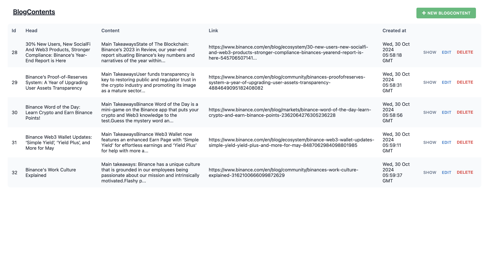

# Blog Web Scraper
This project is a **RedwoodJS-based web application** combined with a **scraper tool** that extracts blog content and stores it in the backend.

Tech Stacks:
- Typescript
- Node.js
- Puppeteer
- Redwood.js

Example Blog Web:
```
https://www.binance.com/en/blog  
https://www.coinbase.com/en-ca/blog
```
---

## Getting Started

### Prerequisites

Make sure you have the following installed:

- **Node.js** (v20)
- **Yarn** (4.5.1)
- **Git**

---

### Installation

1. **Clone the repository:**
   ```bash
   git clone https://github.com/junlin0902/blog-web-scraper.git
   ```
2. **Start the development server for Redwood.js**
    ```bash
    cd app
    yarn install
    yarn redwood dev
    ```
    Your browser should automatically open to ```http://localhost:8910```.

    Change the url to ```http://localhost:8910/blog-contents```. In this page, all the blogs scraped will be stored here.

    

3. **Start the scraper for more blogs**
    ```bash
    cd scrapeer
    npx tsc
    node dist/index.js
    ```

    You can customize the blog websites you want to scrape by modifying the configuration in ```index.ts```:
    ```bash
    const coinbaseConfig: IBlog = {
      blogUrl: 'https://www.coinbase.com/en-sg/', 
      indexPage: 'blog',
      articleLinkSelector: 'a[href^="/en-sg/blog/"]',
      _id: 'coinbase-blog',

      headerSelector: '#article_introduction',
      headerAppearTime: 0,
      headerAppearPos: 1,

      contentSelector: '#article_introduction',
      contentAppearTime: 1,
      contentAppearPos: 0,

      nextButton: "#__next > div > div > div > div > div > div > div > div >    button"
    };
    ```
    1.	`blogUrl`:
	-	Description: The base URL of the blog site you want to scrape.
	-	Example Value: 'https://www.coinbase.com/en-sg/'
	2.	`indexPage`:
	-	Description: The path to the blog’s main page relative to the blogUrl.
	-	Example Value: 'blog'
	3.	`articleLinkSelector`:
	-	Description: A CSS selector that identifies the links to individual blog articles on the index page.
	-	Example Value: 'a[href^="/en-sg/blog/"]'
	4.	`_id`:
	-	Description: A unique identifier for this blog configuration.
	-	Example Value: 'coinbase-blog'
	5.	`headerSelector`:
	-	Description: A CSS selector to locate the header or title within each blog article page.
	-	Example Value: '#article_introduction'
	6.	`headerAppearTime`:
	-	Description: The index position of the times the headerSelector appears.
	-	Example Value: 0
	7.	`headerAppearPos`:
	-	Description: The index position of the header element if multiple elements match the headerSelector.
	-	Example Value: 1
	8.	`contentSelector`:
	-	Description: A CSS selector to locate the main content of the blog article.
	-	Example Value: '#article_introduction'
	9.	`contentAppearTime`:
	-	Description: The index position of the times the contentSelector appears.
	-	Example Value: 1
	10.	`contentAppearPos`:
	-	Description: The index position of the content element if multiple elements match the contentSelector.
	-	Example Value: 0
	11.	`nextButton` (optional):
	-	Description: A CSS selector that identifies the “Next” button or pagination control on the blog index page.
	-	Example Value: "#__next > div > div > div > div > div.cds-flex-f1g67tkn.sc-20f7f24c-0.jxwgNN > div > div > div > div > button"  

    ### Using the Scraper with Your Configuration: 
    The scrapeBlog function is designed to scrape blog articles based on the configuration you provide.  

    In this example, we will scraper 5 blogs from `IBlog coinbaseConfig` and 5 blogs from `IBlog binanceConfig`.   

    Here’s how you can use it:
    ```bash
    (async () => {
      try {
        await scrapeBlog(coinbaseConfig, null, 5);
        await scrapeBlog(binanceConfig, null, 5);
      } catch (error) {
        console.error('Error during test:', error);
      }
    })();
    ```
    #### `scrapeBlog` Function Parameters:
	1.	First Parameter (`config: IBlog`):  
	The IBlog configuration object you created.
	2.	Second Parameter (`existingPage: Page`):  
	An optional existing page or context. Setting it to null means the scraper will start a new page.
	3.	Third Parameter (`limit: number`):  
	The maximum number of blog articles you want to scrape.  
    Setting to `null` means infinite scraping until the end. (Be careful)
